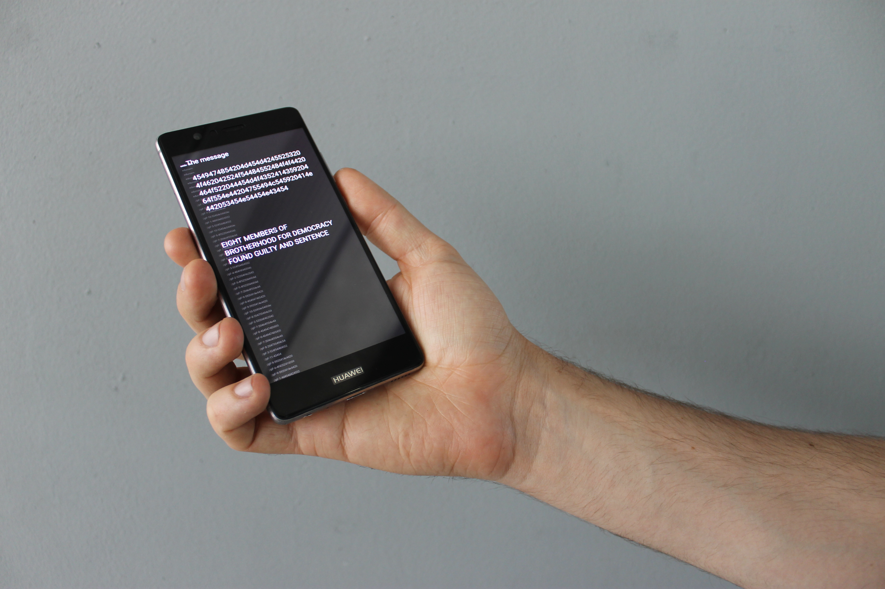

# WifiMessage

WifiMessage is a way to spread hidden messages by using SSIDS to spread this messages


Video  Video  Video  Video  Video  Video  Video  Video  Video  Video  Video  Video  Video  Video  Video  Video  Video  Video  Video  Video  Video  Video  Video  Video  Video  Video  Video  Video  Video  Video  Video  Video  Video  Video  Video 


---

### Requirements:

##### Hardware
* ESP8266


(tested on a Wemos d1 mini pro, not tested on other ESP8266 modules)

* Android smartphone
* Powerbank


(I used [this](https://goo.gl/5Dv75q) powerbank, mainly because it was small)

* USB cable to power the ESP8266
* (Strong) Magnet


(I used [this](https://goo.gl/87LW1D) magnet, because it was the right size compared to my powerbank)

##### Software:

* Arduino IDE
* Processing IDE (with Android mode installed & enabled)

---

### Included in this git:

<!-- (Still have to change this names) -->

**test_wifif_ssids_with_prefix**

To generate the message to for the ESP8266

**wifiMessage_ESP8266**

The ESP8266 Sketch

**wifi_test_3**

The app itself

---

### How to install:

### Generate the prefixes

### On the ESP8266

Open *wifiMessage_ESP8266* with the Arduino environment

Use this instructions on [this](https://github.com/esp8266/Arduino#installing-with-boards-manager) Github to be install the ESP8266 board into the Arduino IDE.

After installation of the board go *tools -> boards* and select **Wemos D1 Mini Pro**

On top of the file change "\*ssids[10]" variable with the *SSIDS* generated by the Processing/python(?) sketch.

The Format has to be like:

```
char *ssids[10] = {":/pF-0-56752048756e6", ":/pF-1-56e6365642074", ":/pF-2-7965617220696", ":/pF-3-f6e2e20687474", ":/pF-4-77772e66726f6", ":/pF-5-46566656e6465", ":/pF-6-2f656e2f63617", ":/pF-7-16e2d72696768", ":/pF-8-656e6465722d7", ":/pF-9-72d6172726573"};
 ```

change the number inside of the "[]" to match the number of *SSIDS*. For this instance it is 10


<!--
1. Generate the SSIDS with the "test_wifif_ssids_with_prefix" Processing sketch.
2. Open wifiMessage_ESP8266 with the Arduino environment


. -->
